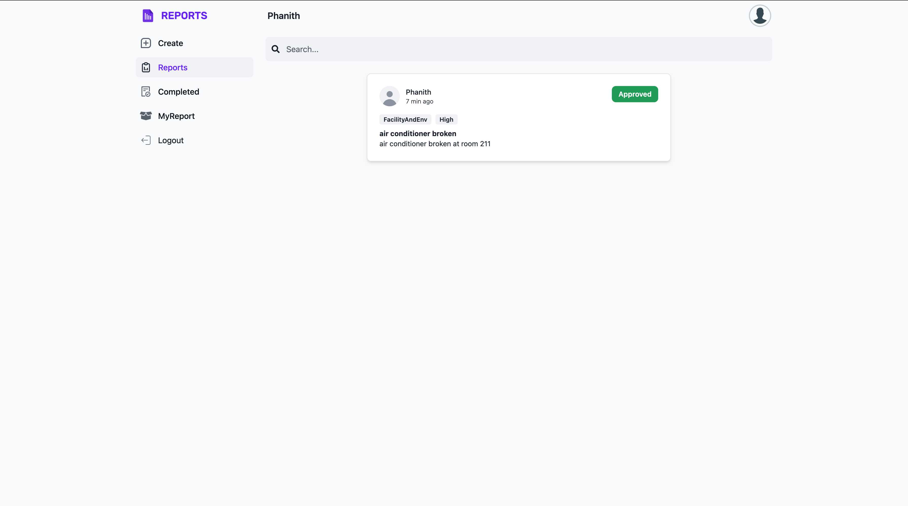
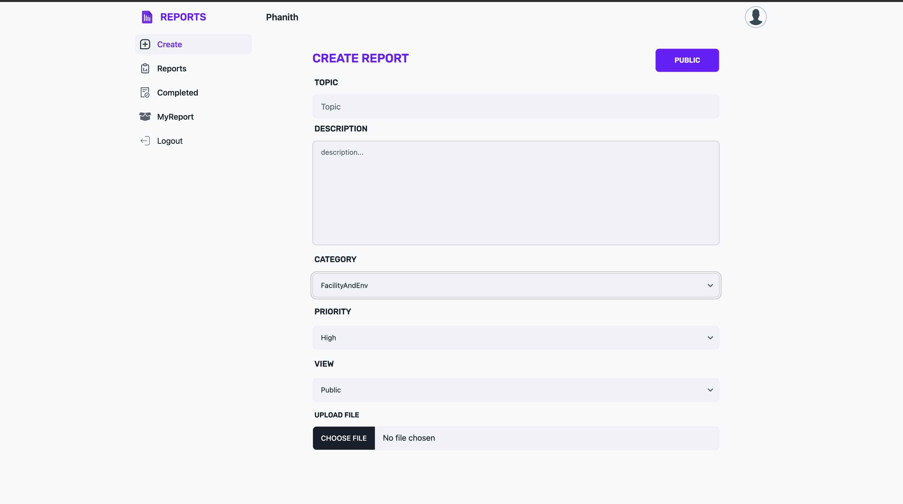

# Report Management System, RUPP

A school's Report Management System handles various issues, like electrical outages or air conditioning problems. It streamlines the reporting process, prioritizes tasks, and ensures efficient issue resolution. Contact the school's administrative offices for specific details.

### Login

### User
|              Report Page              |          Create Report           |
|:-------------------------------------:|:--------------------------------:|
|  |  |
|              Report Page              |          Create Report           |
|:-------------------------------------:|:--------------------------------:|
|  |  |

