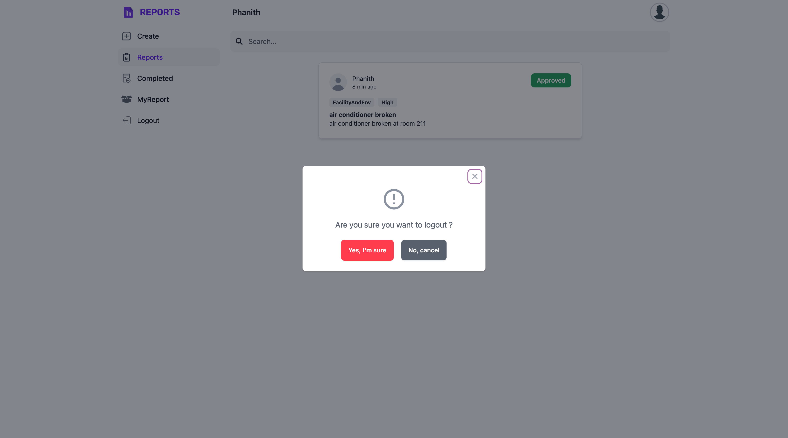
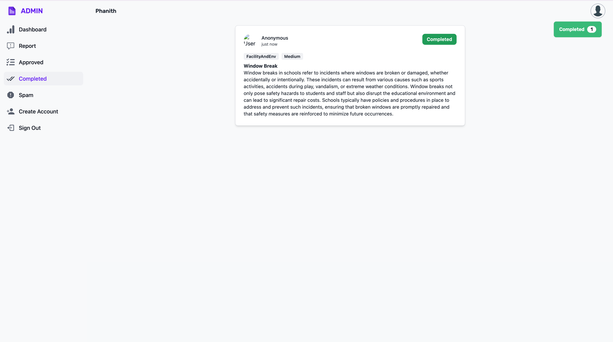

# Report Management System, RUPP

A school's Report Management System handles various issues, like electrical outages or air conditioning problems. It streamlines the reporting process, prioritizes tasks, and ensures efficient issue resolution. Contact the school's administrative offices for specific details.

### Login

### User
|             Report Page             |                        Create Report                        |
|:-----------------------------------:|:-----------------------------------------------------------:|
|     |                             |
| Create Report   select category | Completed Page User can check is their report completed |
|     |                             |
|            MyReport Page            |                      Dropdown Profile                       |
|     |                             |
|            Logout Dialog            | 
|     |

### Admin
|           Dashboard Page            |           See all Report            |
|:-----------------------------------:|:-----------------------------------:|
|    |    |
|            Report Detail            |     Summary report with Gemini      |
|  |  |
|         Filter by Category          |           Filter by Type            |
|  |  |
|         Filter by Priority          |    Mark Approved/Unapproved Page    |
|  |    |
|   Mark Completed/InCompleted Page   |         Spam Detection Page         |
|    |    |
|           Create Account            |           Create Account            |
|    |    |

### AI Model
|     Model      |             Method             |
|:--------------:|:------------------------------:|
| Summary Report |           Gemini API           |
| Spam Detection | CountVectorizer and NaiveBayes |

### UI Library
- Tailwind CSS
- DaisyUI
- Flowbit

### Backend
| Technology |                            Description                            |
|:----------:|:-----------------------------------------------------------------:|
|  FastAPI   |            Framework for build restful api with python            |
|   Resend   |                  Resend is service of send gmail                  |
|   Heroku   |                       Service to deploy api                       |
|  Supabase  | Alternative firebase but it provide PostgreSQL and Authentication |

